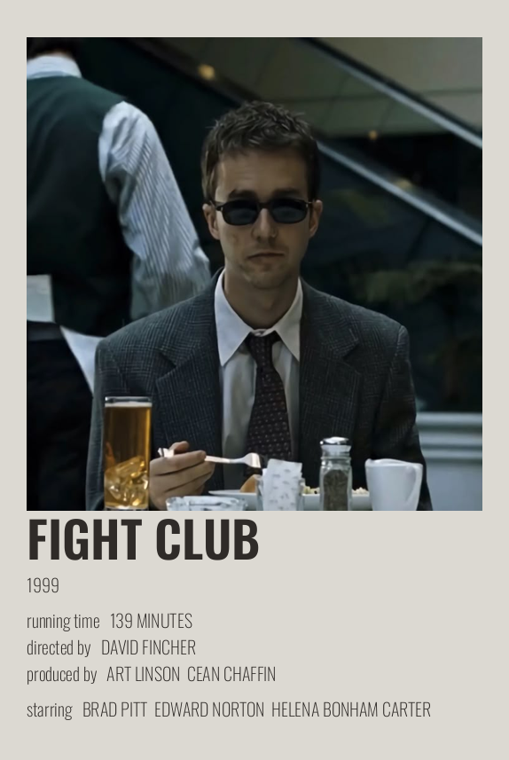
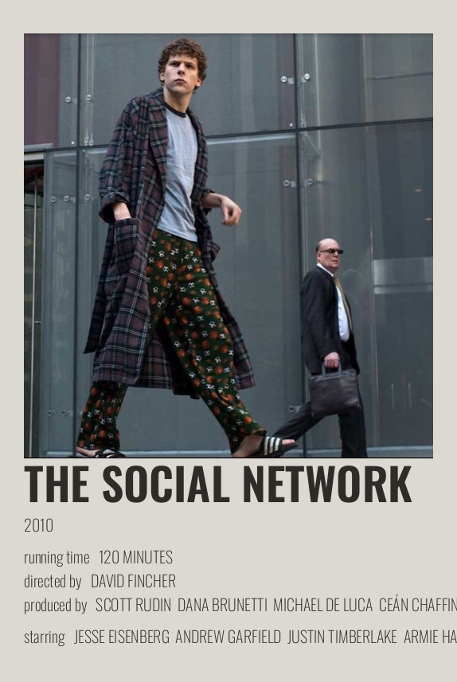
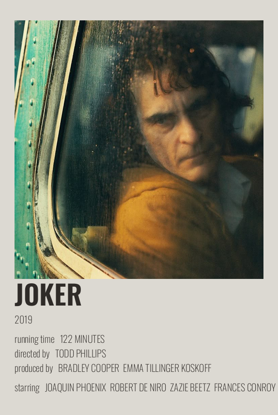
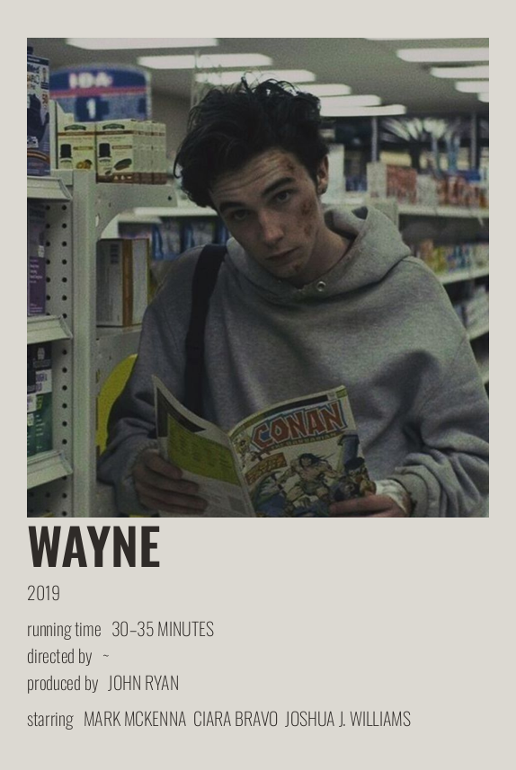
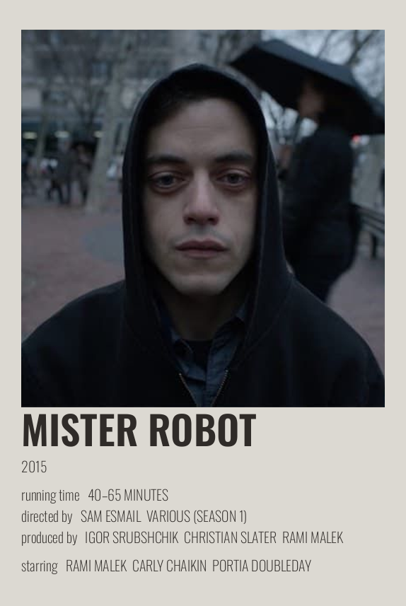

# FILMS-AESTETIC


|  |  |  |  |  |
| - | - | - | - | - | 


Скрипт для создания красивых постеров для фильмов.

# Инструкция по установке

1. **Клонируем репозитрий**

```bash
git clone https://github.com/iamlostshe/FILMS-AESTETIC
cd FILMS-AESTETIC
```

2. **Устанавливаем зависимости и запускаем проект:**

<details>
<summary>
Через uv (рекомендуется)
</summary>

**Устанавливаем `uv` (если еще не установлен):**

Linux:

``` bash
curl -LsSf https://astral.sh/uv/install.sh | sh
```

Windows:

``` bash
powershell -ExecutionPolicy ByPass -c "irm https://astral.sh/uv/install.ps1 | iex"
```

**Запускаем:**

```bash
uv run main.py
```

</details>

<details>
<summary>
Через `requirements.txt`
</summary>

**Создаём виртуальное окружение:**

``` bash
python3 -m venv venv
```

**Активируем виртуальное окружение:**

``` bash
. venv/bin/activate
```

> Последняя команда для Windows:
>
> ``` bash
> venv\Scripts\activate
> ```

**Устанавливаем зависимости:**

``` bash
pip3 install -r requirements.txt
```

**Запускаем бота:**

``` bash
python3 bot.py
```

</details>
